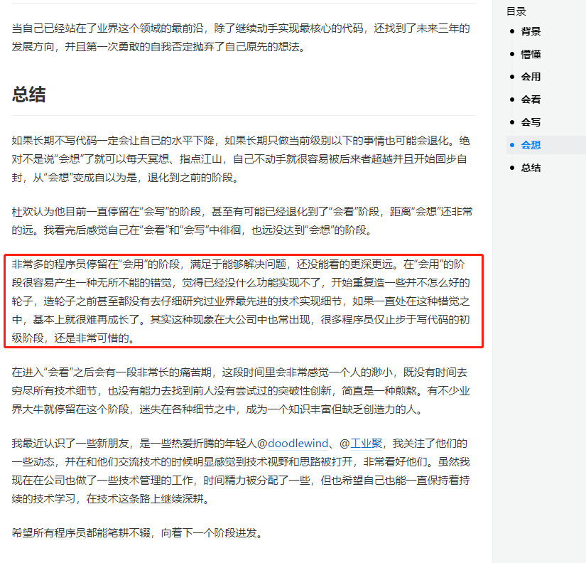

# 1026

> 语录： 请不要，一边担心未来，一边浪费现在！

## 好文推荐

> 不要惧怕做技术分享、写文章、给别人讲解技术点、解决技术问题等，这些事情都是 effort processing 的事情，虽然会耗费脑力，会有点难，但也能让你有非常好的学习效果。

- [写代码水平的几个发展阶段](https://juejin.cn/post/6844903549852188685) 看看黄奕老师对前端职业发展的忠告；附带一篇 [解密初、中、高级程序员的进化之路](https://juejin.cn/post/6844903897593544718)
- [技术总监7年总结——程序员进阶高管的三次跃升](https://juejin.cn/post/6899990715783184391)
- [四句话总结我的学习观](https://juejin.cn/post/7022629591311188004) 神光的学习观： 围绕工作学习，多用 debugger，多重视计算机基础，多做 effort processing 
- [通过分析 Webapck 面试题构建 Webpack5.x 知识体系](https://juejin.cn/post/7023242274876162084) webpack5系列文章

## 项目推荐
- [nest + nuxt.js的全栈项目](https://github.com/givebest/node-nest-vue-nuxt-cms)，文章介绍 [推荐!基于 NestJS/NuxtJS 的完整开源项目](https://mp.weixin.qq.com/s/rxzPMS-W9Rekq_ey0MXMaw)
- [印记中文前端周刊](https://docschina.org/weekly/react/)
- [rrweb 错误回放](https://github.com/rrweb-io/rrweb/blob/master/guide.zh_CN.md) 这是一个很牛逼的项目；之前做过类似 错误监控的实现，这个是错误现场视频的复现，只能说，牛逼！！
---
## 明日计划

## TODOS