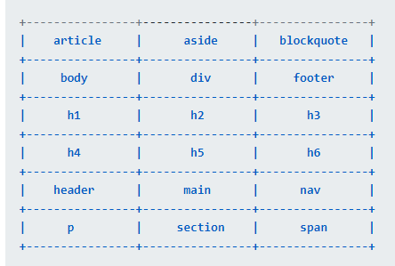
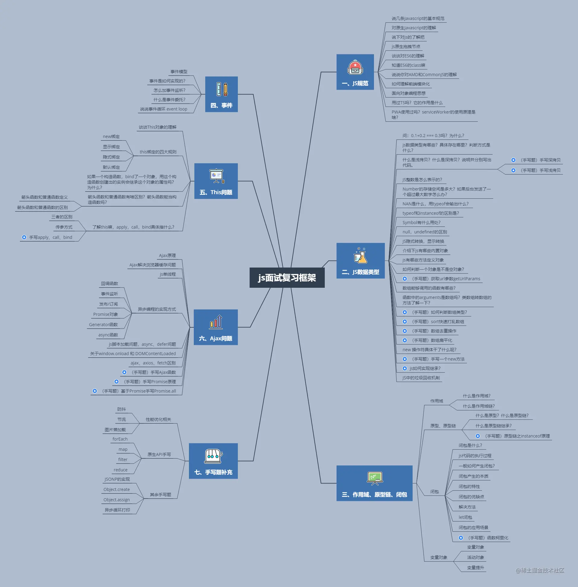

# 1201 今日总结


## 工作

- 学习了解 `shadow-dom`, 主要优点是其 **封闭性**， 可以样式隔离，不会被外部的样式影响到。

那么，前端如何控制 `shadow-dom` 的样式呢？

- 利用 `pesudo` 属性，使用 伪元素 进行控制
- js 创建 `shadown-dom`，操作..

但是需要注意：

并不是所有 html 元素都可以托管 shadow-dom 的，只有以下元素支持, 若不支持，报错 DOMException：



相关资料：

- [深入理解Shadow DOM v1](https://segmentfault.com/a/1190000019115050)
- https://www.jianshu.com/p/e4ac574dcfe2
- https://www.cnblogs.com/coco1s/p/5711795.html
## 心情
> 所见所想，有感而发


## 今日算法

今日学习：


今日复习：


## 手撕代码
> 防抖节流等各种手写，http和网络，浏览器原理，性能优化，Webpack

深浅拷贝：

- 浅拷贝

数组和对象的拷贝方式：

```js
// ... 展开运算符
// Object.assign({}, obj)

let a = { b: 'test' }
let b = { ...a }

// ..., concat, slice
let arr = [1,3,5]
let copy1 = [...arr]
let copy2 = arr.concat()
let copy3 = arr.slice()
```

方法1：若只考虑对象和数组

```js
const shallowClone = (target) => {
  if (typeof target === 'object' && target !== null) {
    const cloneTarget = Array.isArray(target) ? []: {};
    for (let prop in target) {
      if (target.hasOwnProperty(prop)) {
          cloneTarget[prop] = target[prop];
      }
    }
    return cloneTarget;
  } else {
    return target;
  }
}


```

- 深拷贝

方法1： `JSON.stringify, JSON.parse`.

```js
// 1-- JSON.stringify, JSON.parse

let source = {
  a: 'hello, world',
  b: {
    c: 'this is son'
  },
  d: [
    'e', 'f'
  ]
}

let target = JSON.parse(JSON.stringify(source))
```

此方法缺陷：

- 会忽略  undefined
- 会忽略  symbol
- 不能序列化函数
- 不能解决循环引用的对象

方法2：基础版本

```js
let obj1 = {
  a:{
    b:1
  }
}
function deepClone(obj) { 
  let cloneObj = {}
  for(let key in obj) {                 //遍历
    if(typeof obj[key] ==='object') { 
      cloneObj[key] = deepClone(obj[key])  //是对象就再次调用该函数递归
    } else {
      cloneObj[key] = obj[key]  //基本类型的话直接复制值
    }
  }
  return cloneObj
}
let obj2 = deepClone(obj1);
obj1.a.b = 2;
console.log(obj2);   //  {a:{b:1}}
```

方法3：高阶版本；

- 针对能够遍历对象的不可枚举属性以及 Symbol 类型，我们可以使用 Reflect.ownKeys 方法；
- 当参数为 Date、RegExp 类型，则直接生成一个新的实例返回；
- 利用 Object 的 getOwnPropertyDescriptors 方法可以获得对象的所有属性，以及对应的特性，顺便结合 Object 的 create 方法创建一个新对象，并继承传入原对象的原型链；
- 利用 WeakMap 类型作为 Hash 表，因为 WeakMap 是弱引用类型，可以有效防止内存泄漏（可以了解一下 Map 和 weakMap 的关键区别，这里要用 weakMap），作为检测循环引用很有帮助，如果存在循环，则引用直接返回 WeakMap 存储的值。

代码：

```js
// 'Object' | 'Function' | 'Array' ...
const isObj = obj => Object.prototype.toString.call(obj).slice(8, -1) === 'Object'
const deepClone = function (obj, hash = new WeakMap()) {
  if (obj.constructor === Date) {
    // 日期对象直接返回一个新的日期对象
    return new Date(obj)
  }
  if (obj.constructor === RegExp) {
    //正则对象直接返回一个新的正则对象
    return new RegExp(obj)     
  }
  //如果循环引用了就用 weakMap 来解决
  if (hash.has(obj)) {
    return hash.get(obj)
  }
  let allDesc = Object.getOwnPropertyDescriptors(obj)
  //遍历传入参数所有键的特性
  let cloneObj = Object.create(Object.getPrototypeOf(obj), allDesc)
  //继承原型链
  hash.set(obj, cloneObj)
  for (let key of Reflect.ownKeys(obj)) { 
    cloneObj[key] = isObj(obj[key]) ? deepClone(obj[key], hash) : obj[key]
  }
  return cloneObj
}

// 下面是验证代码
let obj = {
  num: 0,
  str: '',
  boolean: true,
  unf: undefined,
  nul: null,
  obj: { name: '我是一个对象', id: 1 },
  arr: [0, 1, 2],
  func: function () { console.log('我是一个函数') },
  date: new Date(0),
  reg: new RegExp('/我是一个正则/ig'),
  [Symbol('1')]: 1,
};
Object.defineProperty(obj, 'innumerable', {
  enumerable: false, value: '不可枚举属性' }
);
obj = Object.create(obj, Object.getOwnPropertyDescriptors(obj))
obj.loop = obj    // 设置loop成循环引用的属性
let cloneObj = deepClone(obj)
cloneObj.arr.push(4)
console.log('obj', obj)
console.log('cloneObj', cloneObj)

```

一维数组转树形结构：

```js
const source = [
  { id: 1, parentId: null },
  { id: 2, parentId: 1 },
  { id: 3, parentId: 1 },
  { id: 4, parentId: 2 },
  { id: 5, parentId: 2 },
  { id: 6, parentId: 3 },
]

// 目标是将 source 转换成下面的结构

// {
//   id: 1, 
//   children: [
//       {
//           id: 2,
//           children: [
//               { id: 4, children: [] },
//               { id: 5, children: [] }
//           ]
//       },
//       {
//           id: 3,
//           children: [
//               { id: 6, children: [] }
//           ]
//       }
//   ]
//   }

const rootObj = {
  id: source.find(s => s.parentId == null).id,
  children: []
}
const map = new Map();
source.filter(s => s.parentId !== null).forEach(item => {
  const subItem = { id: item.id, children: [] };
  if (map.has(item.parentId)) {
    const obj = map.get(item.parentId);
    obj.children.push(subItem)
    map.set(item.parentId, obj)
  } else {
    map.set(item.id, subItem)
  }
})

rootObj.children = [...map.values()]

console.log(JSON.stringify(rootObj))
// console.log([...map.values()])
```


## 好文推荐
> 有感好文

- [一文彻底读懂Babel](https://juejin.cn/post/6901649054225465352)

## 项目/博客推荐
> 值得学习的项目/作者

- [小电视](https://tv.hzfe.org/) 类似之前出现的 [小空调](https://github.com/YunYouJun/air-conditioner)

## 面经相关
> 八股文相关



- [1张思维导图，七大知识板块，保姆级巩固你的js知识体系（4.0w字）](https://juejin.cn/post/7026502510172962829)


**webpack专题**

待整理 webpack 资料，整理后加入 面试题集合内：

- [从基础配置到高级配置，16个知识点带你构建webpack知识体系](https://juejin.cn/post/7030598727643430949) 
- [Webpack配置全解析（基础篇）](https://juejin.cn/post/6844904186912473096)
- [Webpack配置全解析（优化篇）](https://juejin.cn/post/6858905382861946894)
- [Webpack手写loader和plugin](https://juejin.cn/post/6888936770692448270)
- [webpack实战之手写一个简易的loader和plugin](https://juejin.cn/post/6992738808517099528) 
- [Webpack 写一个 markdown loader](https://cloud.tencent.com/developer/article/1819776)

