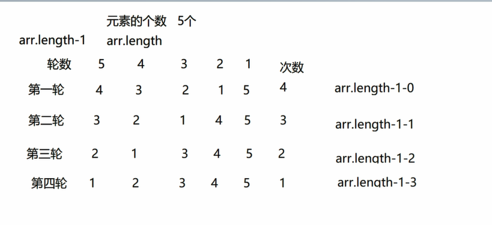

# 1211 今日总结


## 今日工作

## 今日心情
> 所见所想，有感而发


## 今日算法

今日学习：


今日复习：


## 手撕代码
> 防抖节流等各种手写，http和网络，浏览器原理，性能优化，Webpack

冒泡算法：



```js
const array = [5,4,3,2,1,8]

function bubble (arr = []) {
  for (let i = 0; i < arr.length - 1; i++ ) {
    for (let m = 0; m < arr.length - 1 - i; m ++) {
      if (arr[m] > arr [m+1]) {
        const temp = arr[m]
        arr[m] = arr[m+1]
        arr[m+1] = temp
      }
    }
  }
  return arr
}
console.log(bubble(array)) // [ 1, 2, 3, 4, 5, 8 ]

```

- 第一层 for 循环表示比较 轮数
- 第二层 for 循环表示比较的次数


## 好文推荐
> 有感好文


## 项目/博客推荐
> 值得学习的项目/作者


## 面经相关
> 八股文相关

[重绘和回流，如何做性能优化？](https://www.cnblogs.com/AhuntSun-blog/p/11997031.html)


- 回流：dom 结构大小边距的等变化；
- 重绘：颜色，visible 非结构型变化；

**回流必定触发重绘，重绘不一定触发回流；**

性能优化：避免触发回流？

- 分离读写操作：获取 dom 大小，设置 dom 大小；
- 样式集中改变：定义好 样式类，dom 操作切换类名即可；
- 缓存布局信息：先定义好变量代替dom 的大小等属性，后续使用的时候不用操作 DOM 去拿到；
- 元素批量修改：DOM 操作集中一起处理；
- 放弃传统操作 DOM，基于vue/react 开始数据影响视图模式;
- 动画效果使用 position，脱离文档流，而非使用 margin 避免对其他元素影响；
- CSS3 硬件加速：transform、opacity、filters 等属性会触发硬件加速，不触发回流；但是消耗内存，造成耗损；
-  牺牲平滑度换取速度：过渡时间越短，回流时间越短；
- 避免使用 table 布局

## 明日计划

- 算法：
  - 学习：
  - 复习：
- 手写：
- 面经复习：

## TODOS
> 短期内要做的事情