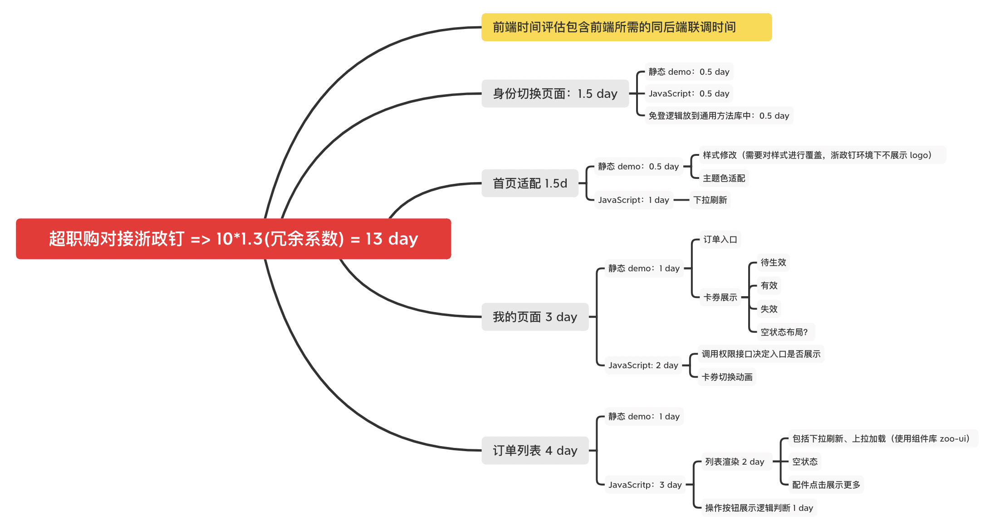
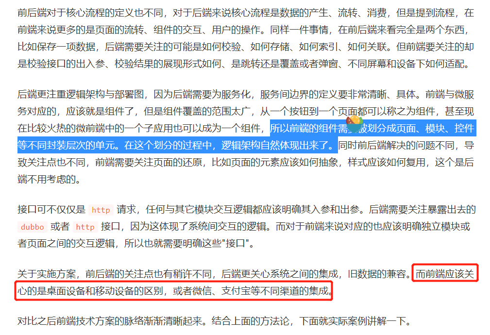

# 1219 今日总结


## 今日工作
> 问题，原因，解决方式，优化，巧妙实现，新知识

今天周日，休息


## 今日心情
> 所见所想，有感而发


## 今日算法

今日学习：


今日复习：


## 手撕代码
> 防抖节流等各种手写，http和网络，浏览器原理，性能优化，Webpack

手写懒加载

```html
<body>
    <div data-v-b2db8566="" 
         data-v-009ea7bb="" 
         data-v-6b46a625=""   
         data-src="https://p1-jj.byteimg.com/tos-cn-i-t2oaga2asx/gold-user-assets/2018/9/27/16619f449ee24252~tplv-t2oaga2asx-image.image" 
         class="lazy thumb thumb"    
         style="background-image: none; background-size: cover;"
         >  
    </div>
</body>


<script>
    // 获取所有的图片标签
    const imgs = document.getElementsByTagName('img')
    // 获取可视区域的高度
    const viewHeight = window.innerHeight || document.documentElement.clientHeight
    // num用于统计当前显示到了哪一张图片，避免每次都从第一张图片开始检查是否露出
    let num = 0
    function lazyload(){
        for(let i=num; i<imgs.length; i++) {
            // 用可视区域高度减去元素顶部距离可视区域顶部的高度
            let distance = viewHeight - imgs[i].getBoundingClientRect().top
            // 如果可视区域高度大于等于元素顶部距离可视区域顶部的高度，说明元素露出
            if(distance >= 0 ){
                // 给元素写入真实的src，展示图片
                imgs[i].src = imgs[i].getAttribute('data-src')
                // 前i张图片已经加载完毕，下次从第i+1张开始检查是否露出
                num = i + 1
            }
        }
    }
    // 监听Scroll事件
    window.addEventListener('scroll', lazyload, false);
</script>
```

来源：[优化首屏体验——Lazy-Load 初探](https://juejin.cn/book/6844733750048210957/section/6844733750119514126)


## 好文推荐
> 有感好文


- https://juejin.cn/post/7041049741458669576 一行 Object.keys() 引发的血案

学习一下作者的排查错误的过程：

```
- 查错过程：

- stackoverflow 查看相关问题
- MDN 文档：object.keys
- pollyfill 对 object.keys 的源码实现
- 翻看 w3c 文档找线索，找到关于 key 的排序过程，分析对比猜想

```

对比一下，我的问题解决能力可能是这样：

```
- google 一下找答案
- mdn 找答案
- 还没解决，原地懵逼？？

```


因此，需要学习作者这种优秀的 debug 能力；


- [Webpack 原理——如何实现代码打包](https://juejin.cn/post/7031342702906048543) 关于 require 是什么和 webpack 打包原理
- [深入理解前端模块加载机制，手写 node.js 的 require 函数](https://zhuanlan.zhihu.com/p/266790788) 拓展学习，require 的实现方式
- [手写CommonJS 中的 require函数](https://juejin.cn/post/6844903998600773646)

## 其他



评论：按照 静态页面 和 js 逻辑来拆分任务也是一个不错的方式；

- [在政采云如何写前端技术方案文档](https://juejin.cn/post/7041713124210114567) 



> 关于实施方案，前后端的关注点也有稍许不同，后端更关心系统之间的集成，旧数据的兼容。而前端应该关心的是**桌面设备和移动设备**的区别，或者微信、支付宝等不同渠道的集成。


## 面经相关
> 八股文相关

- [深入理解前端模块加载机制，手写 node.js 的 require 函数](https://zhuanlan.zhihu.com/p/266790788) 拓展学习，require 的实现方式
- [手写CommonJS 中的 require函数](https://juejin.cn/post/6844903998600773646)